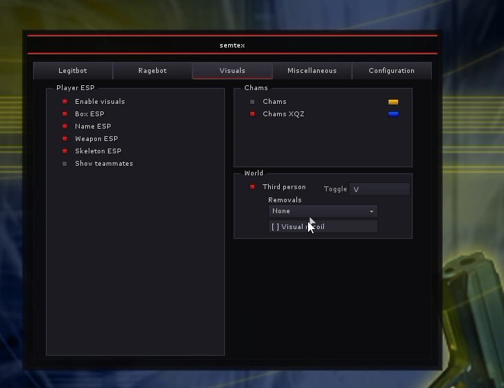

# semtex

modern internal cheat written for the most recent CS 1.6 version of steam.

---

---

## how2inject

run injector.exe or inject the dll through a thirdparty injector.
if you want to debug some basic cheat info realtime use injector.exe

---
## how2use
insert - open menu
end - panic key
keybinds - left click to set, right click to change between hold, toggle, or always

---
## features
aimbot, no recoil, anti-aim, ragebot (needs work), player esp, skeleton esp, weapon esp, chams, xqz chams, third person, visual recoil removal, bunnyhop

---
## disclaimer

This project is provided for educational purposes. Using cheats on live servers violates most terms of service and will get you banned. Use only where you have permission, or offline.
